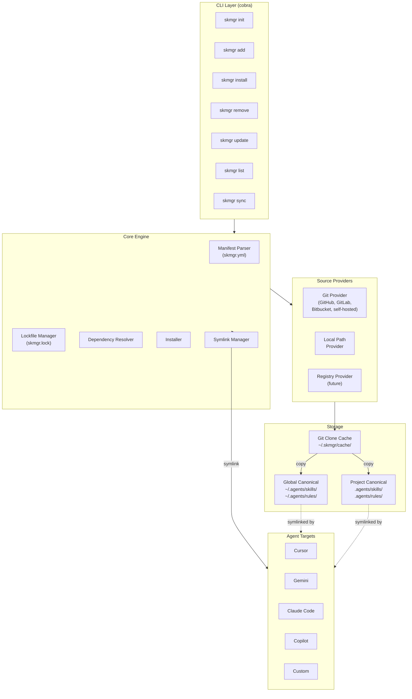

# skmgr — The Framework-Agnostic Skill Manager for AI Agents

A CLI tool (written in Go) that manages AI agent skills and rules as declarative dependencies pulled from any git repository. Think `requirements.txt` for skills — declare them in `skmgr.yml`, run `skmgr install`, and every team member gets the same agent setup.

## User Review Required

> [!IMPORTANT]
> **License Change**: The repo currently has an **MIT License**. You requested **Apache 2.0**. The plan includes replacing the LICENSE file. Confirm this is intentional.

> [!IMPORTANT]
> **Scope Confirmation**: skmgr manages **skills** (SKILL.md directories) and **rules** (AGENTS.md / .cursorrules) — modeled as a special skill type (`type: rule`). It does NOT manage MCP servers, prompts, agents, or hooks.

> [!WARNING]
> **This is a large Go project.** Estimated ~30+ files for v1 (including tests). We'll build iteratively across 10 phases, with tests written at the end of each phase.

## Open Questions

> [!NOTE]
> **`.gitignore` strategy for symlinked agent dirs**: When skmgr creates `.cursor/skills/my-skill → ../../.agents/skills/my-skill`, the `.cursor/skills/` directory shouldn't be committed (it's derived from `.agents/`). skmgr should auto-manage `.gitignore` entries for symlinked paths. The `.agents/` directory itself IS committed (it's the source of truth alongside `skmgr.yml`).

---

## Core Design: Centralized Storage with Symlinks

```
project/
├── .agents/                          ← CANONICAL STORE (committed to git)
│   ├── skills/
│   │   ├── frontend-design/
│   │   │   ├── SKILL.md
│   │   │   └── scripts/
│   │   └── geo-audit/
│   │       └── SKILL.md
│   └── rules/
│       └── coding-standards/
│           └── SKILL.md              (type: rule)
│
├── .cursor/
│   └── skills/
│       ├── frontend-design → ../../.agents/skills/frontend-design   ← SYMLINK
│       └── geo-audit → ../../.agents/skills/geo-audit               ← SYMLINK
│
├── .gemini/config/                   (or .agents/skills/ if Gemini reads from there)
│   └── skills/
│       ├── frontend-design → ../../.agents/skills/frontend-design   ← SYMLINK
│       └── geo-audit → ../../.agents/skills/geo-audit               ← SYMLINK
│
├── skmgr.yml                         ← MANIFEST
└── skmgr.lock                        ← LOCKFILE
```

### Global Scope Layout
```
~/
├── .agents/                          ← GLOBAL CANONICAL STORE
│   ├── skills/
│   │   └── review/
│   │       └── SKILL.md
│   └── rules/
│       └── global-standards/
│           └── SKILL.md
│
├── .cursor/
│   └── skills/
│       └── review → ~/.agents/skills/review                        ← SYMLINK
│
├── .gemini/config/
│   └── skills/
│       └── review → ~/.agents/skills/review                        ← SYMLINK
```

### Symlink Mapping Table

| Agent | Skills Symlink Source | Skills Symlink Target |
|-------|---------------------|-----------------------|
| **cursor** | `.cursor/skills/<name>` | → `.agents/skills/<name>` |
| **gemini** | `.gemini/config/skills/<name>` (global) or `.agents/skills/<name>` (project¹) | → `.agents/skills/<name>` |
| **claude-code** | `.claude/skills/<name>` | → `.agents/skills/<name>` |
| **copilot** | `.github/skills/<name>` | → `.agents/skills/<name>` |
| **custom** | User-specified path | → `.agents/skills/<name>` |

¹ Gemini already reads from `.agents/skills/` at project level — no symlink needed; skmgr detects this and skips.

| Agent | Rules Symlink Source | Rules Symlink Target |
|-------|---------------------|----------------------|
| **cursor** | `.cursor/rules/<name>.md` or `.cursorrules` | → `.agents/rules/<name>/SKILL.md` |
| **gemini** | `.agents/AGENTS.md` (content merged) | ← Merge, not symlink |
| **claude-code** | `.claude/CLAUDE.md` (content merged) | ← Merge, not symlink |
| **copilot** | `.github/copilot-instructions.md` (content merged) | ← Merge, not symlink |

> [!NOTE]
> **Rules for agents that use a single file** (AGENTS.md, CLAUDE.md, copilot-instructions.md) can't be symlinked — they need content merging. skmgr will manage marked sections within these files using delimiters:
> ```markdown
> <!-- skmgr:start:coding-standards -->
> [rule content here]
> <!-- skmgr:end:coding-standards -->
> ```

### Windows Compatibility

Symlinks on Windows require Developer Mode or admin privileges. skmgr will:
1. **Try symlink first** (works if Developer Mode is enabled)
2. **Fall back to junction points** (works for directories without admin)
3. **Fall back to copy** (last resort, warns about duplication)

---

## Architecture Overview



**Flow**: Git clone → `~/.skmgr/cache/` → copy skill dir to `.agents/skills/<name>` → symlink from each agent's native path.

---

## Proposed Changes

---

### Phase 1: Project Scaffolding & Core Types

#### [NEW] [go.mod](file:///Users/aagawade/github/skmgr/go.mod)
Go module: `github.com/AbhishekGawade1999/skmgr`. Dependencies: `cobra`, `yaml.v3`, `color` (terminal styling).

#### [NEW] [main.go](file:///Users/aagawade/github/skmgr/main.go)
Entry point — delegates to `cmd.Execute()`.

#### [MODIFY] [LICENSE](file:///Users/aagawade/github/skmgr/LICENSE)
Replace MIT with Apache 2.0.

#### Phase 1 Tests

No behavioral tests at this stage — the scaffolding is validated by a successful `go build ./...`. This is verified in Phase 1 itself by running the build command.

```bash
# Verification: project compiles
go build ./...
```

---

### Phase 2: Internal Domain Types (`internal/types/`)

#### [NEW] [internal/types/manifest.go](file:///Users/aagawade/github/skmgr/internal/types/manifest.go)

```go
type Manifest struct {
    Name    string            `yaml:"name"`
    Version string            `yaml:"version,omitempty"`
    Targets []string          `yaml:"targets"`
    Skills  []SkillDependency `yaml:"skills"`
}

type SkillDependency struct {
    Name    string   `yaml:"name"`
    Source  string   `yaml:"source"`
    Path    string   `yaml:"path,omitempty"`
    Ref     string   `yaml:"ref,omitempty"`
    Type    string   `yaml:"type,omitempty"`     // "skill" (default) or "rule"
    Scope   string   `yaml:"scope,omitempty"`    // "project" (default) or "global"
    Targets []string `yaml:"targets,omitempty"`
}
```

**Example `skmgr.yml`:**
```yaml
name: my-project
version: "1.0"
targets:
  - cursor
  - gemini

skills:
  - name: frontend-design
    source: https://github.com/anthropics/skills.git
    path: skills/frontend-design
    ref: v2.1.0

  - name: geo-audit
    source: https://github.com/user/seo-skills.git
    path: geo/geo-audit
    ref: main

  - name: coding-standards
    source: https://github.com/acme/standards.git
    path: rules/typescript
    type: rule
    ref: v1.0.0

  - name: my-private-skill
    source: file:///Users/me/skills/custom-skill

  - name: review
    source: https://github.com/cursor/skills.git
    path: review
    scope: global
    ref: abc123def

  - name: deploy-helper
    source: https://gitlab.internal.com/team/agent-skills.git
    path: deploy-helper
    ref: v3.0
    targets:
      - claude-code
```

#### [NEW] [internal/types/lockfile.go](file:///Users/aagawade/github/skmgr/internal/types/lockfile.go)

```go
type Lockfile struct {
    Version     string      `yaml:"version"`
    GeneratedAt string      `yaml:"generated_at"`
    Entries     []LockEntry `yaml:"entries"`
}

type LockEntry struct {
    Name        string `yaml:"name"`
    Source      string `yaml:"source"`
    Path        string `yaml:"path,omitempty"`
    CommitSHA   string `yaml:"commit_sha"`
    ContentHash string `yaml:"content_hash"`
    ResolvedAt  string `yaml:"resolved_at"`
}
```

#### [NEW] [internal/types/config.go](file:///Users/aagawade/github/skmgr/internal/types/config.go)
Agent target config — defines the symlink source path for each agent.

#### Phase 2 Tests

#### [NEW] [internal/types/manifest_test.go](file:///Users/aagawade/github/skmgr/internal/types/manifest_test.go)

| # | Test Case | What It Validates |
|---|-----------|-------------------|
| 1 | `TestSkillDependency_DefaultType` | `Type` defaults to `"skill"` when empty |
| 2 | `TestSkillDependency_DefaultScope` | `Scope` defaults to `"project"` when empty |
| 3 | `TestManifest_YAMLRoundTrip` | Marshal → Unmarshal produces identical struct |
| 4 | `TestLockEntry_YAMLRoundTrip` | Lockfile struct survives YAML round-trip |

---

### Phase 3: Manifest & Lockfile I/O (`internal/manifest/`, `internal/lockfile/`)

#### [NEW] [internal/manifest/parser.go](file:///Users/aagawade/github/skmgr/internal/manifest/parser.go)
Parse `skmgr.yml` / `skmgr.yaml` → `Manifest`. Validate fields, detect duplicates.

#### [NEW] [internal/manifest/writer.go](file:///Users/aagawade/github/skmgr/internal/manifest/writer.go)
Write `Manifest` back to YAML (for `add` / `remove`). Preserve comments where possible.

#### [NEW] [internal/lockfile/lockfile.go](file:///Users/aagawade/github/skmgr/internal/lockfile/lockfile.go)
Read/write `skmgr.lock`. Compare lockfile state vs manifest for drift detection. Generate content hashes.

#### Phase 3 Tests

#### [NEW] [internal/manifest/parser_test.go](file:///Users/aagawade/github/skmgr/internal/manifest/parser_test.go)

| # | Test Case | What It Validates |
|---|-----------|-------------------|
| 1 | `TestParse_ValidManifest` | Full valid `skmgr.yml` parses correctly into struct |
| 2 | `TestParse_MinimalManifest` | Manifest with only `name` + one skill parses |
| 3 | `TestParse_MissingName` | Returns error when `name` field is absent |
| 4 | `TestParse_DuplicateSkillNames` | Returns error when two skills share the same `name` |
| 5 | `TestParse_InvalidYAML` | Malformed YAML returns a parse error |
| 6 | `TestParse_EmptyFile` | Empty file returns a clear error |
| 7 | `TestParse_UnknownFields` | Unknown YAML keys are silently ignored (forward compat) |
| 8 | `TestParse_InvalidType` | `type: banana` returns a validation error |
| 9 | `TestParse_InvalidScope` | `scope: universe` returns a validation error |
| 10 | `TestParse_BothExtensions` | Detects `skmgr.yml` and `skmgr.yaml` (prefers `.yml`) |

#### [NEW] [internal/manifest/writer_test.go](file:///Users/aagawade/github/skmgr/internal/manifest/writer_test.go)

| # | Test Case | What It Validates |
|---|-----------|-------------------|
| 1 | `TestWrite_RoundTrip` | Parse → Write → Parse produces identical `Manifest` |
| 2 | `TestWrite_AddSkill` | Adding a skill to an existing manifest preserves other entries |
| 3 | `TestWrite_RemoveSkill` | Removing a skill leaves the rest intact |
| 4 | `TestWrite_EmptySkills` | Writing a manifest with zero skills produces valid YAML |

#### [NEW] [internal/lockfile/lockfile_test.go](file:///Users/aagawade/github/skmgr/internal/lockfile/lockfile_test.go)

| # | Test Case | What It Validates |
|---|-----------|-------------------|
| 1 | `TestLockfile_RoundTrip` | Read → Write → Read produces identical lockfile |
| 2 | `TestLockfile_DetectDrift` | Detects when manifest has a skill not in lockfile |
| 3 | `TestLockfile_DetectOrphan` | Detects when lockfile has a skill not in manifest |
| 4 | `TestLockfile_ContentHash` | SHA256 hash of a test directory is deterministic |
| 5 | `TestLockfile_MissingFile` | Reading a non-existent lockfile returns nil (not error) |

#### Test Fixtures

#### [NEW] [testdata/manifests/valid_full.yml](file:///Users/aagawade/github/skmgr/testdata/manifests/valid_full.yml)
Complete manifest with all field types for parser tests.

#### [NEW] [testdata/manifests/valid_minimal.yml](file:///Users/aagawade/github/skmgr/testdata/manifests/valid_minimal.yml)
Minimal valid manifest.

#### [NEW] [testdata/manifests/invalid_no_name.yml](file:///Users/aagawade/github/skmgr/testdata/manifests/invalid_no_name.yml)
Manifest missing `name` field.

#### [NEW] [testdata/manifests/invalid_duplicate_names.yml](file:///Users/aagawade/github/skmgr/testdata/manifests/invalid_duplicate_names.yml)
Manifest with duplicate skill names.

#### [NEW] [testdata/manifests/invalid_yaml.yml](file:///Users/aagawade/github/skmgr/testdata/manifests/invalid_yaml.yml)
Malformed YAML.

#### [NEW] [testdata/lockfiles/valid.lock](file:///Users/aagawade/github/skmgr/testdata/lockfiles/valid.lock)
Valid lockfile for round-trip tests.

---

### Phase 4: Source Providers (`internal/source/`)

#### [NEW] [internal/source/provider.go](file:///Users/aagawade/github/skmgr/internal/source/provider.go)
```go
type Provider interface {
    Fetch(source string, ref string) (cachedPath string, resolvedSHA string, err error)
    Matches(source string) bool
}
```

#### [NEW] [internal/source/git.go](file:///Users/aagawade/github/skmgr/internal/source/git.go)
Git provider:
- Clone to `~/.skmgr/cache/<url-hash>/` (deduplicated across projects)
- Shallow clone for speed; full clone only when resolving SHAs
- Support tag, branch, commit SHA refs
- Auth via git credential helpers (SSH keys, HTTPS tokens)
- Any valid git URL

#### [NEW] [internal/source/local.go](file:///Users/aagawade/github/skmgr/internal/source/local.go)
Local path provider: `file://` URLs, absolute/relative paths. Copy to `.agents/` for consistency.

#### Phase 4 Tests

#### [NEW] [internal/source/provider_test.go](file:///Users/aagawade/github/skmgr/internal/source/provider_test.go)

| # | Test Case | What It Validates |
|---|-----------|-------------------|
| 1 | `TestGitProvider_Matches_HTTPS` | Matches `https://github.com/...`, `https://gitlab.com/...` |
| 2 | `TestGitProvider_Matches_SSH` | Matches `git@github.com:...` |
| 3 | `TestGitProvider_Matches_SelfHosted` | Matches `https://git.internal.com/...` |
| 4 | `TestGitProvider_NotMatches_FileURL` | Does NOT match `file:///path/to/...` |
| 5 | `TestLocalProvider_Matches_FileURL` | Matches `file:///path/to/...` |
| 6 | `TestLocalProvider_Matches_AbsPath` | Matches `/Users/me/skills/foo` |
| 7 | `TestLocalProvider_NotMatches_HTTPS` | Does NOT match `https://...` |

#### [NEW] [internal/source/git_test.go](file:///Users/aagawade/github/skmgr/internal/source/git_test.go)

| # | Test Case | What It Validates |
|---|-----------|-------------------|
| 1 | `TestGitFetch_ClonesToCache` | Clones repo into `~/.skmgr/cache/<hash>/` |
| 2 | `TestGitFetch_TagRef` | Checks out correct tag and returns its commit SHA |
| 3 | `TestGitFetch_BranchRef` | Checks out branch and returns HEAD SHA |
| 4 | `TestGitFetch_CommitSHARef` | Checks out exact commit SHA |
| 5 | `TestGitFetch_InvalidURL` | Returns clear error for unreachable URL |
| 6 | `TestGitFetch_InvalidRef` | Returns error for non-existent tag/branch |
| 7 | `TestGitFetch_CacheReuse` | Second fetch reuses cached clone (git fetch, not re-clone) |
| 8 | `TestGitFetch_PathExtraction` | Extracts subdirectory from cloned repo correctly |
| 9 | `TestGitFetch_PathNotFound` | Returns error when path doesn't exist in repo |

> [!NOTE]
> Git tests that require network access use a **test helper** that creates a temporary local bare git repo with known commits/tags. No external network calls in unit tests.

#### [NEW] [internal/source/local_test.go](file:///Users/aagawade/github/skmgr/internal/source/local_test.go)

| # | Test Case | What It Validates |
|---|-----------|-------------------|
| 1 | `TestLocalFetch_CopiesDirectory` | Copies local skill dir to target |
| 2 | `TestLocalFetch_FileURL` | Handles `file:///path/to/skill` correctly |
| 3 | `TestLocalFetch_RelativePath` | Resolves relative paths against working dir |
| 4 | `TestLocalFetch_NotExists` | Returns error for non-existent path |
| 5 | `TestLocalFetch_NotADirectory` | Returns error when path points to a file |

#### Test Helpers

#### [NEW] [internal/testutil/gitrepo.go](file:///Users/aagawade/github/skmgr/internal/testutil/gitrepo.go)
Helper to create temporary bare git repos with:
- Known commits, tags, and branches
- Skill directories with `SKILL.md` files at specified paths
- Used by git provider tests and later integration tests

---

### Phase 5: Symlink Manager (`internal/linker/`)

#### [NEW] [internal/linker/linker.go](file:///Users/aagawade/github/skmgr/internal/linker/linker.go)
Orchestrates symlink creation/removal per agent:
```go
func (l *Linker) LinkSkill(agent string, skillName string, scope string, projectRoot string) error
func (l *Linker) LinkRule(agent string, ruleName string, scope string, projectRoot string) error
func (l *Linker) UnlinkSkill(agent string, skillName string, scope string, projectRoot string) error
func (l *Linker) UnlinkRule(agent string, ruleName string, scope string, projectRoot string) error
func (l *Linker) Verify(manifest *Manifest, scope string, projectRoot string) []LinkIssue
```

#### [NEW] [internal/linker/symlink.go](file:///Users/aagawade/github/skmgr/internal/linker/symlink.go)
Cross-platform symlink operations:
- `createSymlink(target, linkPath)` — Unix symlink, Windows junction/DevMode/copy fallback
- `isSymlink(path)`, `resolveSymlink(path)`, `removeSymlink(path)`

#### [NEW] [internal/linker/merger.go](file:///Users/aagawade/github/skmgr/internal/linker/merger.go)
Content merger for single-file rules (AGENTS.md, CLAUDE.md, copilot-instructions.md):
- Insert between `<!-- skmgr:start:<name> -->` / `<!-- skmgr:end:<name> -->` delimiters
- Update existing sections in place
- Remove sections cleanly
- Preserve user content outside managed sections

#### [NEW] [internal/linker/gitignore.go](file:///Users/aagawade/github/skmgr/internal/linker/gitignore.go)
Auto-manage `.gitignore`:
- Managed section: `# skmgr:managed` … `# skmgr:end`
- Add/remove symlinked agent paths
- Never touch user entries outside managed section

#### Phase 5 Tests

#### [NEW] [internal/linker/symlink_test.go](file:///Users/aagawade/github/skmgr/internal/linker/symlink_test.go)

| # | Test Case | What It Validates |
|---|-----------|-------------------|
| 1 | `TestCreateSymlink_Basic` | Creates a symlink that resolves to target |
| 2 | `TestCreateSymlink_CreatesParentDirs` | Creates intermediate directories if missing |
| 3 | `TestCreateSymlink_AlreadyExists_SameTarget` | No-op when symlink already points to correct target |
| 4 | `TestCreateSymlink_AlreadyExists_DifferentTarget` | Replaces symlink pointing to wrong target |
| 5 | `TestCreateSymlink_RegularFileExists` | Returns error when a non-symlink file occupies the path |
| 6 | `TestIsSymlink_True` | Returns true for a symlink |
| 7 | `TestIsSymlink_False_RegularDir` | Returns false for a regular directory |
| 8 | `TestIsSymlink_False_NotExists` | Returns false for non-existent path |
| 9 | `TestRemoveSymlink_Basic` | Removes symlink without following it |
| 10 | `TestRemoveSymlink_NotExists` | No-op for non-existent path |
| 11 | `TestRemoveSymlink_RefusesRegularFile` | Returns error if path is not a symlink |

#### [NEW] [internal/linker/linker_test.go](file:///Users/aagawade/github/skmgr/internal/linker/linker_test.go)

| # | Test Case | What It Validates |
|---|-----------|-------------------|
| 1 | `TestLinkSkill_Cursor_Project` | Creates `.cursor/skills/<name> → .agents/skills/<name>` |
| 2 | `TestLinkSkill_Gemini_Project_Skipped` | Gemini project-scope: no symlink created (reads `.agents/` natively) |
| 3 | `TestLinkSkill_Gemini_Global` | Creates `~/.gemini/config/skills/<name> → ~/.agents/skills/<name>` |
| 4 | `TestLinkSkill_Claude_Project` | Creates `.claude/skills/<name> → .agents/skills/<name>` |
| 5 | `TestLinkSkill_Copilot_Project` | Creates `.github/skills/<name> → .agents/skills/<name>` |
| 6 | `TestLinkSkill_MultipleAgents` | Creates symlinks for all agents in targets list |
| 7 | `TestUnlinkSkill_RemovesSymlink` | Removes symlink, leaves `.agents/` intact |
| 8 | `TestUnlinkSkill_AllAgents` | Removes symlinks from all target agents |
| 9 | `TestVerify_AllLinksValid` | Returns no issues when all symlinks are correct |
| 10 | `TestVerify_BrokenSymlink` | Detects symlink pointing to deleted target |
| 11 | `TestVerify_MissingSymlink` | Detects expected symlink that doesn't exist |

#### [NEW] [internal/linker/merger_test.go](file:///Users/aagawade/github/skmgr/internal/linker/merger_test.go)

| # | Test Case | What It Validates |
|---|-----------|-------------------|
| 1 | `TestMerge_InsertIntoEmptyFile` | Creates file with delimited section |
| 2 | `TestMerge_InsertIntoExistingFile` | Appends section, preserves existing content |
| 3 | `TestMerge_UpdateExistingSection` | Replaces content between existing delimiters |
| 4 | `TestMerge_MultipleSections` | Manages multiple independent sections in one file |
| 5 | `TestMerge_PreservesUserContent` | User content outside delimiters is untouched |
| 6 | `TestRemoveSection_Basic` | Removes delimited section cleanly |
| 7 | `TestRemoveSection_LastSection` | Removing last managed section leaves user content |
| 8 | `TestRemoveSection_NotFound` | No-op when section name doesn't exist |
| 9 | `TestRemoveSection_FileNotExists` | No-op when target file doesn't exist |

#### [NEW] [internal/linker/gitignore_test.go](file:///Users/aagawade/github/skmgr/internal/linker/gitignore_test.go)

| # | Test Case | What It Validates |
|---|-----------|-------------------|
| 1 | `TestGitignore_AddEntry_NewFile` | Creates `.gitignore` with managed section |
| 2 | `TestGitignore_AddEntry_ExistingFile` | Appends managed section to existing `.gitignore` |
| 3 | `TestGitignore_AddEntry_ExistingSection` | Adds new path to existing managed section |
| 4 | `TestGitignore_AddEntry_Duplicate` | Doesn't duplicate an already-present path |
| 5 | `TestGitignore_RemoveEntry` | Removes a single path from managed section |
| 6 | `TestGitignore_RemoveEntry_LastOne` | Removes the entire managed section when last entry removed |
| 7 | `TestGitignore_PreservesUserEntries` | User entries outside managed section are untouched |
| 8 | `TestGitignore_Rebuild` | Full rebuild from manifest produces correct section |

---

### Phase 6: Agent Target Definitions (`internal/target/`)

#### [NEW] [internal/target/registry.go](file:///Users/aagawade/github/skmgr/internal/target/registry.go)
```go
type AgentDef struct {
    Name            string
    SkillsDir       func(scope string, root string) string
    RulesPath       func(scope string, root string) string
    RuleStrategy    string   // "symlink" | "merge"
    ReadsFromAgents bool     // skip symlink if agent natively reads .agents/
}
```

#### [NEW] [internal/target/agents.go](file:///Users/aagawade/github/skmgr/internal/target/agents.go)
Built-in agent definitions:

| Agent | SkillsDir | RulesPath | RuleStrategy | ReadsFromAgents |
|-------|-----------|-----------|--------------|-----------------|
| `cursor` | `.cursor/skills/` / `~/.cursor/skills/` | `.cursor/rules/` | `symlink` | `false` |
| `gemini` | `.agents/skills/` / `~/.gemini/config/skills/` | `.agents/AGENTS.md` | project=`skip`, global=`merge` | project=`true` |
| `claude-code` | `.claude/skills/` | `.claude/CLAUDE.md` | `merge` | `false` |
| `copilot` | `.github/skills/` | `.github/copilot-instructions.md` | `merge` | `false` |

#### Phase 6 Tests

#### [NEW] [internal/target/registry_test.go](file:///Users/aagawade/github/skmgr/internal/target/registry_test.go)

| # | Test Case | What It Validates |
|---|-----------|-------------------|
| 1 | `TestGetAgent_Cursor` | Returns correct Cursor agent definition |
| 2 | `TestGetAgent_Gemini` | Returns correct Gemini agent definition |
| 3 | `TestGetAgent_ClaudeCode` | Returns correct Claude Code definition |
| 4 | `TestGetAgent_Copilot` | Returns correct Copilot definition |
| 5 | `TestGetAgent_Unknown` | Returns error for unrecognized agent name |
| 6 | `TestListAgents` | Returns all registered agents |
| 7 | `TestCursorSkillsDir_Project` | Returns `.cursor/skills/` for project scope |
| 8 | `TestCursorSkillsDir_Global` | Returns `~/.cursor/skills/` for global scope |
| 9 | `TestGeminiSkillsDir_Project` | Returns `.agents/skills/` (native, no symlink) |
| 10 | `TestGeminiSkillsDir_Global` | Returns `~/.gemini/config/skills/` |
| 11 | `TestGeminiReadsFromAgents_Project` | Returns `true` for project scope |
| 12 | `TestGeminiReadsFromAgents_Global` | Returns `false` for global scope |

---

### Phase 7: Core Engine (`internal/engine/`)

#### [NEW] [internal/engine/engine.go](file:///Users/aagawade/github/skmgr/internal/engine/engine.go)
Orchestrates the full lifecycle:

```
skmgr install flow:
  1. Parse skmgr.yml
  2. Read skmgr.lock (if exists)
  3. For each skill:
     a. Fetch source → ~/.skmgr/cache/
     b. Extract skill (path selector) → .agents/skills/<name>/ or .agents/rules/<name>/
     c. For each target agent:
        - If agent reads from .agents/ natively → skip
        - If skill type → create symlink from agent dir → .agents/skills/<name>
        - If rule type + symlink strategy → create symlink
        - If rule type + merge strategy → merge content into agent's rules file
     d. Update .gitignore with symlinked paths
  4. Write skmgr.lock with resolved SHAs + content hashes
```

#### [NEW] [internal/engine/resolver.go](file:///Users/aagawade/github/skmgr/internal/engine/resolver.go)
- Resolve refs to concrete commit SHAs
- Detect name conflicts
- Validate skill paths within repos
- Compare with lockfile for update detection

#### [NEW] [internal/engine/installer.go](file:///Users/aagawade/github/skmgr/internal/engine/installer.go)
- Copy skill dir from cache to `.agents/skills/<name>/`
- Compute content hashes
- Handle update-in-place
- Clean up orphans on sync

#### Phase 7 Tests

#### [NEW] [internal/engine/resolver_test.go](file:///Users/aagawade/github/skmgr/internal/engine/resolver_test.go)

| # | Test Case | What It Validates |
|---|-----------|-------------------|
| 1 | `TestResolve_TagToSHA` | Tag ref resolved to commit SHA |
| 2 | `TestResolve_BranchToSHA` | Branch ref resolved to HEAD SHA |
| 3 | `TestResolve_SHAPassthrough` | Commit SHA ref passes through unchanged |
| 4 | `TestResolve_ConflictingNames` | Two skills with same name returns error |
| 5 | `TestResolve_PathValidation` | Non-existent path within repo returns error |
| 6 | `TestResolve_LockfileMatch` | When lockfile SHA matches, skips re-resolution |
| 7 | `TestResolve_LockfileMismatch` | When manifest ref changed, re-resolves |

#### [NEW] [internal/engine/installer_test.go](file:///Users/aagawade/github/skmgr/internal/engine/installer_test.go)

| # | Test Case | What It Validates |
|---|-----------|-------------------|
| 1 | `TestInstall_CopiesSkillToAgentsDir` | Skill dir copied to `.agents/skills/<name>/` |
| 2 | `TestInstall_CopiesRuleToAgentsDir` | Rule dir copied to `.agents/rules/<name>/` |
| 3 | `TestInstall_UpdateReplacesExisting` | Existing skill dir is replaced on update |
| 4 | `TestInstall_ContentHashDeterministic` | Same content always produces same hash |
| 5 | `TestInstall_SkillDirContainsSKILLMD` | Validates installed dir contains SKILL.md |
| 6 | `TestInstall_PreservesSubdirectories` | Copies scripts/, references/ etc. within skill |
| 7 | `TestCleanOrphans_RemovesUnlisted` | Removes `.agents/skills/` entries not in manifest |
| 8 | `TestCleanOrphans_PreservesListed` | Keeps skills that are in the manifest |

#### [NEW] [internal/engine/engine_test.go](file:///Users/aagawade/github/skmgr/internal/engine/engine_test.go)

| # | Test Case | What It Validates |
|---|-----------|-------------------|
| 1 | `TestEngine_Install_EndToEnd` | Full install: fetch → copy to .agents → symlink → lockfile |
| 2 | `TestEngine_Install_Frozen` | `--frozen` mode uses lockfile SHAs, no network resolution |
| 3 | `TestEngine_Install_FrozenNoLockfile` | `--frozen` with no lockfile returns error |
| 4 | `TestEngine_Update_Single` | Updates one skill, leaves others untouched |
| 5 | `TestEngine_Update_All` | Re-resolves all skills |
| 6 | `TestEngine_Remove` | Removes skill from .agents + symlinks + lockfile |
| 7 | `TestEngine_Sync_AddsMissing` | Installs skills in manifest but missing from .agents |
| 8 | `TestEngine_Sync_RemovesOrphans` | Removes skills in .agents but not in manifest |
| 9 | `TestEngine_Sync_FixesBrokenSymlinks` | Recreates broken symlinks |
| 10 | `TestEngine_GlobalScope` | Installs to `~/.agents/` with correct global symlinks |
| 11 | `TestEngine_PerSkillTargetOverride` | Skill with `targets: [claude-code]` only symlinks to Claude |
| 12 | `TestEngine_GitignoreUpdated` | `.gitignore` managed section reflects installed symlinks |

> [!NOTE]
> Engine tests use the `testutil/gitrepo.go` helper to create local fixture repos and a temp directory as the project root. No real `~/.skmgr/` or `~/.agents/` is touched — paths are overridden via dependency injection.

---

### Phase 8: CLI Commands (`cmd/`)

#### [NEW] [cmd/root.go](file:///Users/aagawade/github/skmgr/cmd/root.go)
```
skmgr — The framework-agnostic skill manager for AI agents

Usage:
  skmgr [command]

Commands:
  init        Initialize a new skmgr.yml in the current directory
  add         Add a skill/rule to the manifest and install it
  remove      Remove a skill/rule from the manifest and uninstall it
  install     Install all skills from the manifest
  update      Update one or all skills to latest matching version
  list        List installed skills with status
  sync        Synchronize installed state with manifest

Flags:
  -g, --global    Operate on global scope (~/.agents/)
  -v, --verbose   Verbose output
  -q, --quiet     Suppress non-error output
      --version   Print version
```

#### [NEW] [cmd/init.go](file:///Users/aagawade/github/skmgr/cmd/init.go)
`skmgr init`:
- Detect existing agent configs (`.cursor/`, `.gemini/`, `.claude/`)
- Create `.agents/skills/` and `.agents/rules/` directories
- Generate starter `skmgr.yml` with detected targets
- Optionally scan existing skills and import into manifest

#### [NEW] [cmd/add.go](file:///Users/aagawade/github/skmgr/cmd/add.go)
`skmgr add <source> [flags]`:
```bash
skmgr add https://github.com/anthropics/skills.git \
  --path skills/frontend-design \
  --name frontend-design \
  --ref v2.1.0 \
  --type skill
```

#### [NEW] [cmd/remove.go](file:///Users/aagawade/github/skmgr/cmd/remove.go)
`skmgr remove <name>`

#### [NEW] [cmd/install.go](file:///Users/aagawade/github/skmgr/cmd/install.go)
`skmgr install [--frozen]`

#### [NEW] [cmd/update.go](file:///Users/aagawade/github/skmgr/cmd/update.go)
`skmgr update [name]`

#### [NEW] [cmd/list.go](file:///Users/aagawade/github/skmgr/cmd/list.go)
`skmgr list [--json]`:
```
NAME               TYPE   SCOPE    REF       STATUS      TARGETS
frontend-design    skill  project  v2.1.0    ✅ current   cursor, gemini
geo-audit          skill  project  main      ⚠️ outdated  cursor, gemini
coding-standards   rule   project  v1.0.0    ✅ current   cursor, claude-code
review             skill  global   abc123d   ❌ missing   cursor
```

#### [NEW] [cmd/sync.go](file:///Users/aagawade/github/skmgr/cmd/sync.go)
`skmgr sync`

#### Phase 8 Tests

#### [NEW] [cmd/init_test.go](file:///Users/aagawade/github/skmgr/cmd/init_test.go)

| # | Test Case | What It Validates |
|---|-----------|-------------------|
| 1 | `TestInit_CreatesManifest` | `skmgr.yml` created with project name |
| 2 | `TestInit_CreatesAgentsDirs` | `.agents/skills/` and `.agents/rules/` created |
| 3 | `TestInit_DetectsCursorDir` | `.cursor/` present → auto-adds `cursor` to targets |
| 4 | `TestInit_DetectsGeminiDir` | `.gemini/` present → auto-adds `gemini` to targets |
| 5 | `TestInit_NoAgentDirs` | No agent dirs found → empty targets, warns user |
| 6 | `TestInit_AlreadyInitialized` | Returns error if `skmgr.yml` already exists |

#### [NEW] [cmd/add_test.go](file:///Users/aagawade/github/skmgr/cmd/add_test.go)

| # | Test Case | What It Validates |
|---|-----------|-------------------|
| 1 | `TestAdd_AppendsToManifest` | New skill entry appears in `skmgr.yml` |
| 2 | `TestAdd_WithAllFlags` | `--name`, `--path`, `--ref`, `--type`, `--scope` all applied |
| 3 | `TestAdd_DefaultName` | Name inferred from repo or path when `--name` omitted |
| 4 | `TestAdd_DuplicateName` | Returns error when name already exists |
| 5 | `TestAdd_NoManifest` | Returns error when `skmgr.yml` doesn't exist (hint: run init) |
| 6 | `TestAdd_InstallsAfterAdd` | Skill is installed + symlinked, not just added to manifest |

#### [NEW] [cmd/remove_test.go](file:///Users/aagawade/github/skmgr/cmd/remove_test.go)

| # | Test Case | What It Validates |
|---|-----------|-------------------|
| 1 | `TestRemove_RemovesFromManifest` | Entry removed from `skmgr.yml` |
| 2 | `TestRemove_RemovesFromAgentsDir` | `.agents/skills/<name>/` deleted |
| 3 | `TestRemove_RemovesSymlinks` | All agent symlinks for this skill removed |
| 4 | `TestRemove_UpdatesGitignore` | Managed `.gitignore` section updated |
| 5 | `TestRemove_NotFound` | Returns error for unknown skill name |

#### [NEW] [cmd/install_test.go](file:///Users/aagawade/github/skmgr/cmd/install_test.go)

| # | Test Case | What It Validates |
|---|-----------|-------------------|
| 1 | `TestInstall_AllSkills` | All manifest skills installed + symlinked |
| 2 | `TestInstall_WritesLockfile` | `skmgr.lock` created with correct entries |
| 3 | `TestInstall_Frozen` | Uses lockfile SHAs, no new resolution |
| 4 | `TestInstall_NoManifest` | Returns error when no `skmgr.yml` |

#### [NEW] [cmd/update_test.go](file:///Users/aagawade/github/skmgr/cmd/update_test.go)

| # | Test Case | What It Validates |
|---|-----------|-------------------|
| 1 | `TestUpdate_SingleSkill` | Only named skill re-resolved and reinstalled |
| 2 | `TestUpdate_AllSkills` | All skills re-resolved |
| 3 | `TestUpdate_LockfileUpdated` | Lockfile SHAs change after update |
| 4 | `TestUpdate_NoChanges` | Already up-to-date skill reports "nothing to update" |

#### [NEW] [cmd/list_test.go](file:///Users/aagawade/github/skmgr/cmd/list_test.go)

| # | Test Case | What It Validates |
|---|-----------|-------------------|
| 1 | `TestList_TableOutput` | Default output is a formatted table |
| 2 | `TestList_JSONOutput` | `--json` flag produces valid JSON array |
| 3 | `TestList_StatusCurrent` | Installed + matching lockfile = ✅ |
| 4 | `TestList_StatusOutdated` | Newer version available = ⚠️ |
| 5 | `TestList_StatusMissing` | In manifest but not installed = ❌ |
| 6 | `TestList_EmptyManifest` | No skills → "No skills defined" message |

#### [NEW] [cmd/sync_test.go](file:///Users/aagawade/github/skmgr/cmd/sync_test.go)

| # | Test Case | What It Validates |
|---|-----------|-------------------|
| 1 | `TestSync_InstallsMissing` | Skill in manifest but not `.agents/` → installed |
| 2 | `TestSync_RemovesOrphans` | Skill in `.agents/` but not manifest → removed |
| 3 | `TestSync_FixesBrokenSymlinks` | Broken symlink → recreated |
| 4 | `TestSync_ReportsLocalModifications` | Content hash mismatch → warning logged |
| 5 | `TestSync_AlreadyInSync` | Everything matches → "Already in sync" |

> [!NOTE]
> CLI tests use `cobra`'s test helpers to execute commands in-process with captured stdout/stderr. They operate on temp directories and the `testutil/gitrepo.go` helper for fixture repos.

---

### Phase 9: CI/CD & Distribution

#### 9.1 — CI Pipeline

#### [NEW] [.github/workflows/ci.yml](file:///Users/aagawade/github/skmgr/.github/workflows/ci.yml)

Triggers on: `push` to `main`, all `pull_request`s.

```yaml
jobs:
  lint:
    # golangci-lint with .golangci.yml config

  test:
    # Matrix: [ubuntu-latest, macos-latest, windows-latest] × [go 1.22, go 1.23]
    # Run: go test -race -coverprofile=coverage.out ./...
    # Upload coverage to Codecov

  build:
    # Verify go build ./... succeeds on all platforms
    # Smoke test: ./skmgr --version

  integration:
    # Full E2E lifecycle tests on ubuntu + macOS
```

#### [NEW] [.golangci.yml](file:///Users/aagawade/github/skmgr/.golangci.yml)
Linter config: govet, errcheck, staticcheck, gosimple, unused, ineffassign, gocritic, gofmt, misspell.

---

#### 9.2 — Release Pipeline

#### [NEW] [.github/workflows/release.yml](file:///Users/aagawade/github/skmgr/.github/workflows/release.yml)

Triggers on: tag push `v*`.

- GoReleaser: binaries for linux/darwin/windows × amd64/arm64
- GitHub Release with checksums + auto-generated changelog
- Homebrew tap formula update
- Install script published as release asset

#### [NEW] [.goreleaser.yml](file:///Users/aagawade/github/skmgr/.goreleaser.yml)
GoReleaser configuration.

---

#### 9.3 — Security Pipeline

#### [NEW] [.github/workflows/security.yml](file:///Users/aagawade/github/skmgr/.github/workflows/security.yml)

Triggers on: `pull_request`, weekly schedule.

- `govulncheck` — known vulnerability detection
- `gosec` — SAST security scanning
- OpenSSF Scorecard — repo security posture
- `actions/dependency-review-action` — PR dependency audit

---

#### 9.4 — Integration Test Pipeline

#### [NEW] [.github/workflows/integration.yml](file:///Users/aagawade/github/skmgr/.github/workflows/integration.yml)

Triggers on: `pull_request`, daily schedule.

- Full lifecycle E2E: init → add → install → list → update → sync → remove
- Symlink verification per OS (junction fallback on Windows)
- Multi-agent symlink test (cursor + gemini + claude-code)
- Rule merge test (delimited sections in CLAUDE.md)

---

#### 9.5 — Install Script Test

#### [NEW] [.github/workflows/install-script.yml](file:///Users/aagawade/github/skmgr/.github/workflows/install-script.yml)

Triggers on: changes to `scripts/install.sh`, release publication.

- Run `install.sh` on ubuntu + macOS
- Verify binary placed, `--version` works, `init` works

#### [NEW] [scripts/install.sh](file:///Users/aagawade/github/skmgr/scripts/install.sh)
Detect OS/arch → download binary → verify checksum → install to PATH.

---

#### 9.6 — Dependabot

#### [NEW] [.github/dependabot.yml](file:///Users/aagawade/github/skmgr/.github/dependabot.yml)
Weekly updates for Go modules and GitHub Actions.

#### Phase 9 Tests

No new Go test files — Phase 9 produces CI/CD configs. Validation is:

| # | Verification | What It Validates |
|---|-------------|-------------------|
| 1 | `act` or manual GH Actions dry-run | Workflow YAML is syntactically valid |
| 2 | Push a test tag to a fork | Release pipeline produces binaries |
| 3 | `shellcheck scripts/install.sh` | Install script has no shell issues |
| 4 | `goreleaser check` | GoReleaser config is valid |

---

### Phase 10: Comprehensive README

#### [MODIFY] [README.md](file:///Users/aagawade/github/skmgr/README.md)

The final phase rewrites the README from scratch with full documentation. Sections:

| Section | Content |
|---------|---------|
| **Header** | Logo, tagline, badges (CI, release, Go version, license, Codecov) |
| **Elevator Pitch** | 3-sentence explanation of what skmgr does and why it exists |
| **Features** | Bullet list: YAML manifest, lockfile, any git remote, monorepo support, agent-agnostic, centralized `.agents/` + symlinks, rules support, global/project scope |
| **Quick Comparison** | Table: skmgr vs APM vs `gh skill` vs `skilld` |
| **Installation** | Sub-sections for every channel: Homebrew (`brew install AbhishekGawade1999/tap/skmgr`), Go install, curl \| sh, GitHub Releases manual download, Linux package managers (apt, yum — future) |
| **Quickstart** | Step-by-step: `skmgr init` → `skmgr add` → `skmgr install` → `skmgr list`. Full terminal session example with output |
| **Manifest Reference** | Complete `skmgr.yml` specification: every field, types, defaults, constraints. Includes a fully annotated example manifest |
| **Lockfile** | Explain `skmgr.lock`: purpose, when it's generated, `--frozen` flag, when to commit it |
| **CLI Reference** | Every command with synopsis, flags, examples, and expected output: `init`, `add`, `remove`, `install`, `update`, `list`, `sync`, `--version` |
| **How It Works: Symlinks** | Architecture diagram + detailed explanation of the `.agents/` → agent directory symlink model. Per-agent table. Windows fallback explanation |
| **Rules** | How `type: rule` works: symlink strategy vs merge strategy, delimiter format, which agents use which strategy |
| **Agent Compatibility** | Table of supported agents with skill dir, rules path, rule strategy, and `ReadsFromAgents` flag |
| **Scopes** | Project scope (`.agents/`) vs global scope (`~/.agents/`), when to use which |
| **`.gitignore` Management** | How skmgr auto-manages `.gitignore` for symlinked paths, managed section format |
| **CI/CD Usage** | How to use skmgr in CI: `skmgr install --frozen` for reproducible builds |
| **Configuration** | Global config at `~/.skmgr/config.yml` (future), cache location |
| **Contributing** | How to contribute: fork, branch, test, PR. Code structure overview. How to add a new agent target |
| **License** | Apache 2.0 with copyright |

#### Phase 10 Tests

No new Go test files. Validation:

| # | Verification | What It Validates |
|---|-------------|-------------------|
| 1 | Render check | README renders correctly on GitHub (preview via `gh repo view`) |
| 2 | Link validation | All internal links and anchors resolve |
| 3 | Code block validation | All code examples in README are syntactically valid YAML/bash |
| 4 | Badge validation | CI/release/license badges resolve to correct URLs |

---

## Complete Directory Structure

```
skmgr/
├── main.go
├── go.mod
├── go.sum
├── LICENSE                                   # Apache 2.0
├── README.md                                 # Comprehensive (Phase 10)
├── .goreleaser.yml
├── .golangci.yml
├── .github/
│   ├── dependabot.yml
│   └── workflows/
│       ├── ci.yml
│       ├── release.yml
│       ├── security.yml
│       ├── integration.yml
│       └── install-script.yml
├── cmd/
│   ├── root.go
│   ├── init.go
│   ├── init_test.go
│   ├── add.go
│   ├── add_test.go
│   ├── remove.go
│   ├── remove_test.go
│   ├── install.go
│   ├── install_test.go
│   ├── update.go
│   ├── update_test.go
│   ├── list.go
│   ├── list_test.go
│   ├── sync.go
│   └── sync_test.go
├── internal/
│   ├── types/
│   │   ├── manifest.go
│   │   ├── manifest_test.go
│   │   ├── lockfile.go
│   │   └── config.go
│   ├── manifest/
│   │   ├── parser.go
│   │   ├── parser_test.go
│   │   ├── writer.go
│   │   └── writer_test.go
│   ├── lockfile/
│   │   ├── lockfile.go
│   │   └── lockfile_test.go
│   ├── source/
│   │   ├── provider.go
│   │   ├── provider_test.go
│   │   ├── git.go
│   │   ├── git_test.go
│   │   ├── local.go
│   │   └── local_test.go
│   ├── linker/
│   │   ├── linker.go
│   │   ├── linker_test.go
│   │   ├── symlink.go
│   │   ├── symlink_test.go
│   │   ├── merger.go
│   │   ├── merger_test.go
│   │   ├── gitignore.go
│   │   └── gitignore_test.go
│   ├── target/
│   │   ├── registry.go
│   │   ├── registry_test.go
│   │   └── agents.go
│   ├── engine/
│   │   ├── engine.go
│   │   ├── engine_test.go
│   │   ├── resolver.go
│   │   ├── resolver_test.go
│   │   ├── installer.go
│   │   └── installer_test.go
│   └── testutil/
│       └── gitrepo.go                        # Shared test helper
├── scripts/
│   └── install.sh
└── testdata/
    ├── manifests/
    │   ├── valid_full.yml
    │   ├── valid_minimal.yml
    │   ├── invalid_no_name.yml
    │   ├── invalid_duplicate_names.yml
    │   └── invalid_yaml.yml
    ├── lockfiles/
    │   └── valid.lock
    └── sample_skill/
        └── SKILL.md
```

---

## Test Coverage Summary by Phase

| Phase | Package | Test Files | Test Cases | Focus |
|-------|---------|-----------|------------|-------|
| 1 | — | — | — | Build verification only |
| 2 | `internal/types` | `manifest_test.go` | 4 | YAML round-trip, defaults |
| 3 | `internal/manifest`, `internal/lockfile` | `parser_test.go`, `writer_test.go`, `lockfile_test.go` | 19 | Parsing, validation, I/O, drift detection |
| 4 | `internal/source` | `provider_test.go`, `git_test.go`, `local_test.go` | 21 | URL matching, clone, cache, path extraction |
| 5 | `internal/linker` | `symlink_test.go`, `linker_test.go`, `merger_test.go`, `gitignore_test.go` | 39 | Symlinks, merging, gitignore, per-agent linking |
| 6 | `internal/target` | `registry_test.go` | 12 | Agent definitions, path resolution |
| 7 | `internal/engine` | `resolver_test.go`, `installer_test.go`, `engine_test.go` | 27 | Resolution, installation, full lifecycle |
| 8 | `cmd` | `init_test.go`, `add_test.go`, `remove_test.go`, `install_test.go`, `update_test.go`, `list_test.go`, `sync_test.go` | 32 | CLI behavior, flags, output format |
| 9 | — | — | 4 (manual) | CI/CD config validation |
| 10 | — | — | 4 (manual) | README rendering, links, badges |
| **Total** | | **23 test files** | **~162 test cases** | |

---

## Verification Plan

### Automated Tests
```bash
go test -race -cover ./...           # All unit + integration tests
golangci-lint run ./...              # Lint
goreleaser build --snapshot --clean   # Build verification
goreleaser check                     # Release config validation
shellcheck scripts/install.sh        # Install script linting
```

### Manual Verification
1. `skmgr init` → creates `.agents/skills/`, `.agents/rules/`, `skmgr.yml`
2. `skmgr add <repo> --path skills/test --ref v1.0` → clones, copies to `.agents/skills/test/`, symlinks to `.cursor/skills/test`, updates `.gitignore`
3. `skmgr install` → full lifecycle from clean state
4. `skmgr list` → table with correct status per skill
5. `skmgr sync` → detects broken symlinks, missing skills, orphans
6. `skmgr update` → re-resolves SHAs, updates `.agents/`, lockfile
7. `skmgr remove test` → removes symlinks + `.agents/skills/test/` + manifest entry
8. Verify Gemini project-scope skips symlink (reads `.agents/` natively)
9. Verify rule merge into CLAUDE.md with correct delimiters
10. Verify lockfile is deterministic across runs
11. Verify README renders correctly on GitHub
